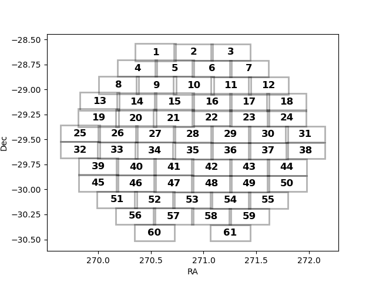

# decam-processing

Tools for further processing of DECam data products after photpipe processing. Scripts here are meant to be used in the `esmeralda-mint2` server. The scripts and methods shared here have been developed by [Nicolas Rodriguez-Segovia](https://nrsegovia.github.io/), feel free to reach out and ask questions, report bugs or suggest improvements.


## Contents

- [Data description](#data-description)
- [Reducing NOIRLab files using `photpipe`](#reducing-noirlab-files-using-photpipe)
- [BEFORE USING THE SCRIPTS](#before-using-the-scripts)
- [Adding `photpipe` catalogues to the database](#adding-photpipe-catalogues-to-the-database)
- [Checking data coverage](#checking-data-coverage)
- [Retrieving data](#retrieving-data)
- [Exploring individual catalogues](#exploring-individual-catalogues)
- [Exploring individual images](#exploring-individual-images)

## Data description
## Reducing NOIRLab files using `photpipe`
## BEFORE USING THE SCRIPTS

The following sections make use of the scripts presented in this repository. As such, I assume that you are using them in the `\data\DECAMNOAO\ShoCd\decam-processing` directory. I also assume that you have created a conda environment using the `environment.yml` file and activated it:
```
conda env create -f environment.yml
conda activate decam
```
Or, at the very least, you have installed the python packages listed in `environment.yml`.

## Adding `photpipe` catalogues to the database

## Checking data coverage

You can run the `visualize_coverage.py` script to take a look at the current data available or, more specifically, the approximate CCD coverage for all the processed fields. An example is given below for the `EAST` field.



## Retrieving data

To fully take advantage of the database, the data (light curve) retrieval works in two steps. The first step matches a user-provided catalog against the master catalogues built in the previous section. The match makes uses of `STILTS` and its `tmatch2` algorithm, under the `find=all` configuration. This means that all matches within the user-provided radius and coordinates are returned. This results in a matched catalogue which you will find in the output directory.

The matched catalogue contains both the input catalogue columns as well as information from the master catalogue. The latter is internally used when retrieving data points from the database (second step of the process), and is necessary to identify individual light curves in the resulting data.

### Example light curve retrieval

As of writing this documentation, only `csv` format is allowed for input catalogues. In principle, only columns for right ascension and declination are required, though for posterior analysis ID and period or columns related to other relevant data are encouraged. For this example, I will name my catalogue `variables.csv` and it will contain the `ID,RA,Dec` columns. Then, matching is as simple as:

```
./decam_processing.py --directory EAST --mode LIGHTCURVE --inputcat /full/path/to/variables.csv --ccds 1 [--parquet] [--outdir /full/path/to/desired/output/location] [--radius 1.0] [--ra RA] [--dec Dec]
```
The arguments are briefly explained below, and you can also find some documentation by running `./decam_processing.py` without arguments. Also, arguments within brackets are optional.
- `directory` corresponds to the directory of data to be processed or analyzed. When retrieving light curves, only `EAST` is currently available.
- `mode` selects what you want to do. In this case, we build light curves, hence the name.
- `inputcat` is the input catalogue. As described above, only csv files are supported and you need columns for RA and Dec (in decimal degrees), at the very least.
- `ccds` corresponds to the ccds being used in the process. HOWEVER, this argument is NOT used in the `LIGHTCURVE` (current) mode. Due to an oversight on my part it is required for the command to succesfully run, though. Setting it as `--ccd 1` will be enough. 
- `parquet` sets whether your output will be `parquet`-formatted (if the flag is present) or `csv` (otherwise). The `parquet` file format is fast and lightweight, though not as easy to read nor modify as `csv`.
- `outdir` sets where to save the output to. It defaults to the local `output/lightcurves` directory, though using the default value is not recommended as your results might be overwritten by yourself or other users.
- `radius` sets the crossmatch radius for your input catalogue sources. The default is 1.0 arseconds, and the maximum value allowed is 10.0 arcseconds.
- `ra` sets the name of the right ascension column in your input catalogue. The default is RA.
- `dec` sets the name of the declination column in your input catalogue. The default is Dec.

If your input catalogue is matched against any sources in the database, you will get at least 2 files as a result of the process. The maximum number of files you get would be 62. This is because you get one matched catalogue plus N data files, with N being the number of DECam CCDs with matches.

### Using the matched data

Since the results are not _per source_, you still have the task of separating them and checking for overlaps ahead of you. The following lines contain some advice/ideas, but you are free to choose whatever you want to do with the data.

- Look at the distance of the matches.
- Filter by `dotype`.
- Look at the data and their individual ID columns.

## Exploring individual catalogues
## Exploring individual images
- Convert `photpipe` output to `parquet` files
- Check for duplicates and remove (rename) as desired by using the mode `mode`
- Put everything into database by using the `mode` mode
